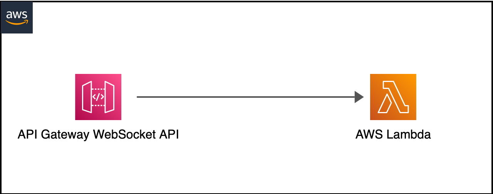
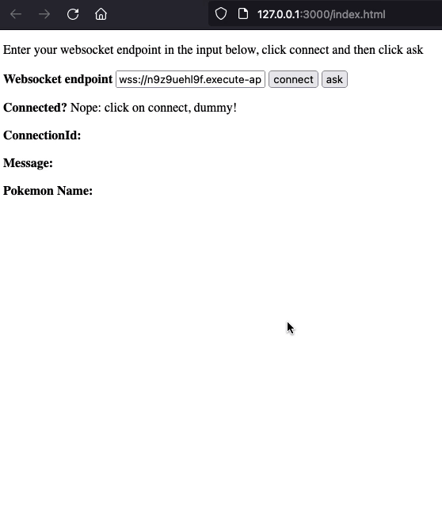

# Serverless Stateless WebSockets on AWS
This is a serverless, stateless implementation of WebSockets on AWS, backed by Amazon API Gateway and Lambda.  
It's only fit for 1:1 communication, as the `connectionId` is not stored anywhere outside of the client.  



## Then why use it?
This is the first step to delegate connection state storage in an Amplify app via the `StorageManager` component.  
There is no real advantage to it apart from not provisioning a DynamoDB table, managing additional IAM permissions to the Cognito Authenticated Role, and one less SDK to use.  

## Deploy
```bash
sam build
sam deploy --guided
```

take note of the output `WebsocketURI` as it will be used in the next step.  
You can also get it by running  
```bash
sam list endpoints --stack-name <stack-name> --output json
```

## Test
```bash
python3 -m http.server 3000
```
then open up a browser at `http://localhost:3000`.  
Paste the value of `WebsocketURI` in the **Websocket Endpoint** input field, as shown below.  
**MAKE SURE YOU REPLACE `HTTPS` WITH `WSS`**  



